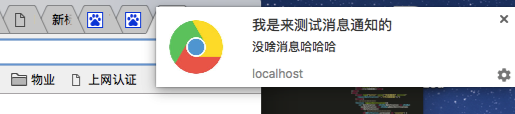
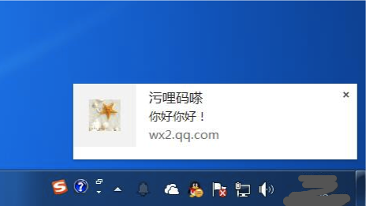
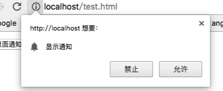
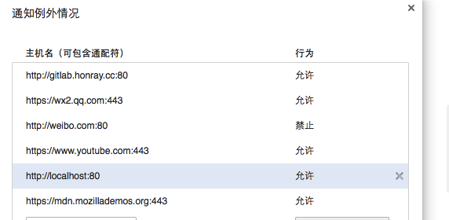

## window桌面通知实现

  1. 怎么实现权限请求 
  2. 在别的页面怎么发送通知，设定定时器
  3. 权限的有效期限
  4. 兼容性问题，不同浏览器有什么区别
  5. 微信如何保持数据同步

参考文献

### 浏览器桌面消息通知推送实现方法

用过微信网页版的人应该都见过新消息通知的通知卡，其实不止微信，各种新闻网站都用到了这个，总喜欢在你沉迷工作的时候弹出奇奇怪怪的通知。
用windows的通常是右下角弹出来：

用mac的通常是右上角弹出来：

其实这个实现很简单，用到了window实例的Notification api，这个api是用来为用户显示通知的，即使用户已经将浏览器窗口最小化并切换到其它应用。

#### 请求权限

浏览器默认是不给桌面通知权限的，需要主动请求权限

	var Notification = window.Notification || window.mozNotification || window.webkitNotification;
	console.log(Notification.permission)
	Notification.requestPermission(function(status){         
        console.log(Notification.permission)
    });
             
在浏览器开发者工具执行上面的代码。Notification.requestPermission的参数是回调函数，用户点击叉叉按钮，则输出default,如果点击允许则输出granted,如果点击禁止则输出denied。

如果之前没有在该域名下请求过这个权限，浏览器会弹出请求权限的窗口：

如果之前没有为该域名请求权限，则不会有弹窗。

注意：如果这段代码放在html中执行，一定要创建虚拟服务器，即用域名访问（如localhost），不能直接用file://test.html 这样的路径访问，因为这个不是http协议，浏览器不接受本地文件的通知设置。

Notification.permission有3个可能值，default, granted, denied。
> default表示还没有发出过请求，或者之前请求过，但是用户并没有允许或者禁止，二是直接关闭窗口。这种状态下是不会有通知的。
> granted表示之前向用户请求过权限，而且用户已经允许了。
> denied表示之前向用户请求过权限，但是用户已经拒绝了。

如果哪天你不想给这个域名通知权限了，有两个方法：

1. 在有通知消息来的时候点击齿轮（多数浏览器是没有的）进入浏览器的设置页面，
2. 直接进入浏览器设置页面。以chrome为例，进入设置->显示高级设置->隐私设置->内容设置->通知->管理例外情况->删除或者调整对应域名下的通知权限

需要注意的是，设置了禁止，则这个网站再也不会弹出请求权限的窗口，如果只是删除这条允许规则，那么这个网站下次还会弹窗请求通知权限。

从上图可以看出，这个通知权限的有效范围是域名＋端口号。一旦设置永远生效，除非手动修改删除。

#### 发送通知消息

发送消息需要创建一个Notification实例，需要带上参数对象。

* title 通知的标题

* options 可选参数
	1. body 显示在标题下面的内容，chrome最多显示5行， Safari最多显示一行。
	2. dir 通知显示的方向，默认是auto，跟随系统。这个我的理解是指卡片内容的显示方向，大部分浏览器无视这个参数，感觉不重要。
	3. lang 通知的语言，[语言码参考](https://www.sitepoint.com/web-foundations/iso-2-letter-language-codes/)。一般不设置的话中英文都能识别。
	4. tag 通知的标识，相当于id，标记唯一性。如果在一个通知窗口还没关闭的时候打开另外一个，但是用的是同一个tag值，那么就只会出现一个弹窗（即替换）。如果用的tag值不同，则会出现多个。
	
			function sendMsg(){
	          var tag = "sds"+Math.random();
	          var notify1 = new Notification(
	              '我是来测试消息通知的1',
	              {
	                  tag:tag,//实例化的notification的id
	                  icon:'chromeLogo.jpg',//通知的缩略图,//icon 支持ico、png、jpg、jpeg格式
	                  body:'没啥消息哈哈哈没啥' //通知的具体内容
	              }
	          );
	          var notify2 = new Notification(
	              '我是来测试消息通知的2',
	              {
	                  tag:tag,//实例化的notification的id TODO 	
	                  icon:'chromeLogo.jpg',//通知的缩略图,//icon 支持ico、png、jpg、jpeg格式
	                  body:'没啥消息哈哈哈没啥' //通知的具体内容
	              }
	          );
	          var notify3 = new Notification(
	              '我是来测试消息通知的3',
	              {
	                  tag:tag,//实例化的notification的id
	                  icon:'chromeLogo.jpg',//通知的缩略图,//icon 支持ico、png、jpg、jpeg格式
	                  body:'没啥消息哈哈哈没啥' //通知的具体内容
	              }
	          );	        
	        }
	       sendMsg();
		       
		执行上面的代码，执行完之后修改TODO处的tag值为tag变量，再执行一次，比较两次区别。多试几个浏览器再观察一下区别。
		 
		本人试了一下，当tag值相同的notify同时创建时，chrome浏览器只会显示最后一个，safari和firefox会间隔0.5s左右按照顺序显示，且窗口只有一个。当tag不同时，chrome浏览器会同时显示多个窗口，而safari和firefox还是会间隔0.5s左右按照顺序显示，且窗口只有一个。
		 
	5. icon 显示在前面的图标，不过有的浏览器无视这个参数替换上自家浏览器的logo，而且，不同浏览器显示位置也有区别。
		
	6. requireInteraction boolean值，表示是否需要用户手动关闭，默认是 false。其实这个设置在safari和 firefox中被无视，在chrome中有效。默认情况下，通知会在弹出一定时间后自动关闭，具体多久不同浏览器也有差别，一般是5-10s，觉得时间太长的话可以调用close方法手动关闭，建议最好手动关闭，如果遇到默认不关闭的浏览器就体验很差了。	
	7. renotify 表示窗口被替换时（相同tag）是否需要通知。其实看了下这个属性基本被无视了，没发现有什区别。
	
#### 消息事件
Notification实例接收4个事件,show，click，error，close分别表示显示，被点击，出错，关闭。最常用的是在click回调中执行window.focus方法激活当前标签页。在show回调中设置定时器执行close方法关闭弹窗。

	function sendMsg(){
          var tag = "sds"+Math.random();
          var notify = new Notification(
              '我是来测试消息通知的',
              {
                  tag:1,//实例化的notification的id
                  icon:'chromeLogo.jpg',//通知的缩略图,//icon 支持ico、png、jpg、jpeg格式
                  body:'没啥消息哈哈哈没啥' + tag, //通知的具体内容
                  requireInteraction: true,
                  renotify: true
              }
          );
          notify.onshow=function(){
              //如果通知消息被点击,通知窗口将被激活
              console.log('notify show');
          },
          notify.onclick=function(){
              //如果通知消息被点击,通知窗口将被激活
              window.focus();
          },
          notify.onerror = function () {
              console.log("桌面消息出错！！！");
          };
          notify.onshow = function () {
              console.log('notify show');
              setTimeout(function(){
                  notify.close();
              },1000)
          };
          notify.onclose = function () {
              console.log("桌面消息关闭！！！");
          };
        }
		sendMsg();
		
#### 实时推送
用到浏览器通知消息，我们想到的场景是什么？以微信为例。

假设我打开了微信手机客户端，也打开了微信网页版。别人给我发送的消息，手机上可以立即接收到，但是网页版会有10s 左右的延迟，毋庸置疑，这个是因为网页版用轮询方法去检查服务器是否有新数据。
	
如果我用手机发送一个消息给别人，网页版会立即刷新，这个肯定不是轮询，二是服务器给网页发送了推送。这个涉及到websocket的知识，稍后补充。