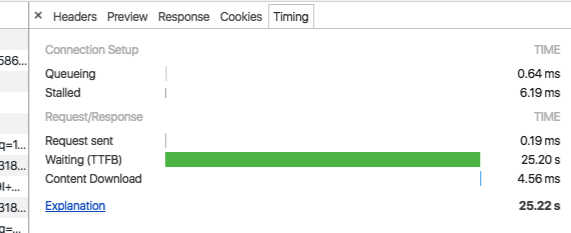

## websocket由来
当一个服务端服务多个互相关联的客户端时，服务端一定程度上充当媒介，为端和端之间传递消息，例如即时通讯。双向信息传递的目的是为了同步信息，同步信息的方式一般有三种解决方案：

- 轮询，客户端周期性请求服务端查看是否有更新，耗费通信双方的资源，缺点明显，而且，实时性很差。

- 长轮询，客户端发送一个超时时间很长（时常一般等于轮询周期）的请求；服务器持有这个请求，在持有期间如果有消息更新就会为这个请求返回结果。否则请求失败，此时再发送下一个请求。这个方法减少了网络请求的频率，但是也一定程度上耗费了服务端的资源，因为服务端要持有这个请求很长一段时间。
	>以微信网页版和手机版为例，服务器服务于网页版客户端和手机客户端。微信有用到轮询，不过只是用在消息接收上。手机会第一时间收到别人发的消息，而微信网页版会有延迟，这点延迟是因为轮询周期大概是10s。但是消息发送（从手机或者浏览器中）时是双客户端即时更新的，从网页版的请求可以分析微信使用的是长轮询方法，轮询周期是25秒，细心的人会发现，用chrome浏览器时顶部标签一直处于loading状态，说明这个页面一直有请求。
		



- 消息推送，消息推送需要建立双向连接，这就是接下来要说的websocket。

websocket是基于TCP协议（OSI传输层）建立全双工通信模式，也就是说服务端也可以给客户端主动推送消息了。


## 原生websocket

### 客户端
1.创建websocket连接
	<script src="/socket.io/socket.io.js"></script>
	// Create WebSocket connection.
	const socket = new WebSocket('ws://localhost:8080');
2.向对方发送消息
	
	// Connection opened
	socket.addEventListener('open', function (event) {
	    socket.send('Hello Server!');
	});
3.事件回调，onclose, onerror, onmessage, onopen。 
	
	// Listen for messages
	socket.addEventListener('message', function (event) {
	    console.log('Message from server', event.data);
	});
4.其它方法调用

	// Close a connection
	socket.close();
5.重要属性：

>readyState（只读），当前连接的状态。

>connecting：值为0，表示正在建立连接

>open：值为1，表示连接已建立，状态变为open时会触发open事件

>closing：值为2，表示正在关闭连接

>closed：值为3，表示连接已关闭，状态变为closed时会触发close事件

### 服务端
服务端可以用现成的websocket库或者socket服务框架


## 基于nodejs的第三方websocket库socket.io
最简单的入门websocket库是 socket.io，这个库有客户端的资源，也有基于nodejs的服务端资源。这两者需要配套使用。

### 客户端
	<!doctype html>
	<html>
	  <head>
	    <title>Socket.IO chat</title>
	    <style>
	      * { margin: 0; padding: 0; box-sizing: border-box; }
	      body { font: 13px Helvetica, Arial; }
	      form { background: #000; padding: 3px; position: fixed; bottom: 0; width: 100%; }
	      form input { border: 0; padding: 10px; width: 90%; margin-right: .5%; }
	      form button { width: 9%; background: rgb(130, 224, 255); border: none; padding: 10px; }
	      #messages { list-style-type: none; margin: 0; padding: 0; }
	      #messages li { padding: 5px 10px; }
	      #messages li:nth-child(odd) { background: #eee; }
	    </style>
	  </head>
	  <body>
	    <ul id="messages"></ul>
	    <form action="">
	      <input id="m" autocomplete="off" /><button>Send</button>
	    </form>
	    <script src="/socket.io/socket.io.js"></script>
	    <script src="https://code.jquery.com/jquery-1.11.1.js"></script>
	    <script>
	      $(function () {
	      <!--建立连接-->
	        var socket = io();
	        <!--设置表单提交回调-->
	        $('form').submit(function(){
	        <!--服务端发送消息-->
	          socket.emit('chat message', $('#m').val());
	          $('#m').val('');
	          return false;
	        });
	        <!--等待服务端的推送事件-->
	        socket.on('chat message', function(msg){
	          $('#messages').append($('<li>').text(msg));
	        });
	      });
	    </script>
	  </body>
	</html>

### 服务端
```
	var app = require('express')();
	var http = require('http').Server(app);
	var io = require('socket.io')(http);
	
	app.get('/', function(req, res){
		res.sendFile(__dirname + '/index.html');
	});
	
	io.on('connection', function(socket){
	  console.log('a user connected');
	  socket.on('disconnect', function(){
	    console.log('user disconnected');
	  });
	  socket.on('chat message', function(msg){
	    console.log('message: ' + msg);
	    socket.emit('chat message', msg + ' (from server)');
	  });
	
	});
	
	http.listen(3000, function(){
	  console.log('listening on *:3000');
	});
```
更详细的使用方法看[官网教程](https://socket.io/)，步骤十分详细。

### 参考链接
[MDN websocket](https://developer.mozilla.org/en-US/docs/Web/API/WebSocket)

[认识HTML5的WebSocket](http://www.cnblogs.com/wei2yi/archive/2011/03/23/1992830.html)

[socket.io](https://socket.io/docs/)
