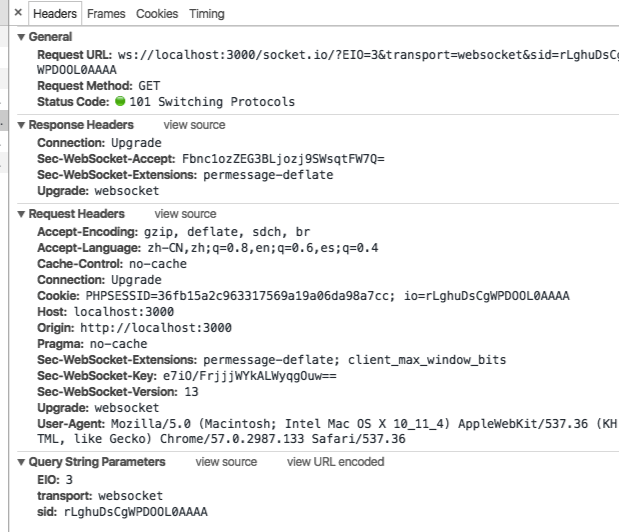

# H5 双向即时通信（websocket）

## 场景

### 双向通信&&多端同步
说一个现实场景（微信网页版）

### long polling

分析微信这样处理的优缺点：
优点：实现起来简单
缺点：浪费带宽，服务器需要保留连接而占用一个 线程

### websocket

作用：
>允许服务器端与客户端进行全双工（full-duplex）的通信

	客户端：
	- “Connection: Upgrade”就表示浏览器通知服务器，如果可以，就升级到webSocket协议
	- Upgrade:websocket 头信息表示将通信协议从HTTP/1.1转向该项所指定的协议
	- Origin用于验证浏览器域名是否在服务器许可的范围内
	- Sec-WebSocket-Key则是用于握手协议的密钥
	服务端：
	- “Connection: Upgrade”通知浏览器，需要改变协议
	-  浏览器用"Sec-WebSocket-Accept"和浏览器请求带上的Sec-WebSocket-Key连接并验证是否是目标服务器进行的回应（具体怎么验证可能涉及到加密问题）。

#### websocket和http的区别与联系
>http连接断开后服务器将不会记得之前请求了什么返回了什么，但是websocket发送请求之后不会断开连接。所以服务器收到请求的时候知道这个请求属于谁。

>http只能是客户端主动请求服务端

>websocket协议在第一次握手连接时，通过http协议告诉服务器“我要切换为ws连接”

>如果服务器支持ws协议，则返回101

chrome devTool 分析
>ws连接并没有中断

>Frames表示客户端和服务器之间的数据传输历史记录

1-1 demo演示

多－1 demo演示

####兼容性

[浏览器兼容性查看](http://caniuse.com/#search=websocket)

####websocket安全
>防攻击：
>>以sec开头的header浏览器脚本无法获取，脚本也不能设置，攻击者无法伪造websocket请求，所以本身有一定的防攻击性

>>CORS不适用于websocket协议，所以，也容易进行跨站攻击，但是websocket的第一次握手会传递origin，服务端需要做好origin校验(两个项目代码交叉演示)，不过origin头部可以被伪造，应该需要加上令牌验证之类的认证措施。

其它demo链接：

[你画我猜](https://www.qcloud.com/community/article/585387001484793629?fromSource=gwzcw.93407.93407.93407)

