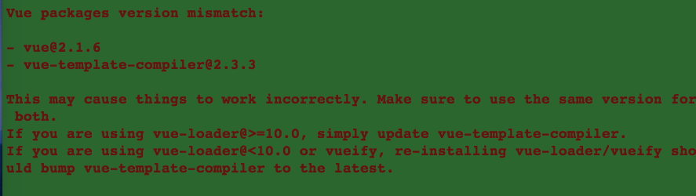
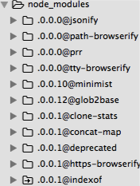

##gitlab环境部署出现的element-ui版本问题的解决办法

###前言1
在vueThink框架基础上的项目中package.json文件部分配置是这样的：

	"dependencies": {
	    "element-theme": "0.2.0",
	    "element-ui": "^1.1.2",
	    "vue": "^2.0.7",
	    "vuex": "2.0.0-rc.6"
	  },
	"devDependencies": {
		"vue-loader": "9.9.5" 
	},
	 	 
^表示安装不低于指定版本的依赖包，默认会安装最新的最稳定的依赖。

然而，我们开发项目的过程中，这些依赖会有稳定版本的更新。也就是说，可能npm install出来的结果和一周后有差别。

例如，上周install的element-ui是1.2.9版本的，这周再install，结果是1.3.0，一般第二个数字的变化意味着大的改动，很可能影响到整个项目的功能。

所以，对于关键的开发依赖，我们最好固定版本，去掉^符号，什么？你没有固定？接着看。什么？你有固定？还是得接着看。

###前言2

1.如果你开发阶段使用的element-ui版本低于1.3.0，开发过程中重新install不小心升级到了1.3.0，那么可能项目中用到dialog的地方会不正常（可能不仅限于dialog）

2.如果你开发阶段使用的element-ui版本低于1.2.9，开发过程中重新install不小心升级到了1.2.9以上的版本，那么可能项目中用到upload和dialog的地方会不正常（可能不仅限于）

3.如果你开发阶段用的element-ui版本低于1.3.0，且vue版本低于2.3.0。开发过程中重新install你会发现vue版本升级到，那么可能项目中用到upload和dialog的地方会不正常（可能不仅限于）

所以，如果项目进行到中后期，就不要再升级element-ui版本了。

###前言3
如果安装的依赖中，element-ui 版本<1.3.0，且vue版本>=2.3.0时Table组件的checkbox select（多选）功能会出问题，select组件会崩溃。上一部分我们分析的结果是，不要随便更新element-ui版本，那么，怎么办，vue降级。比如说降到2.2.6。这样就行了吗？没有
	
我们试着降级然后run dev看看：

这个报错告诉我们，vue-template-compiler的版本和vue的版本要一毛一样才行。

###前言4
我们新框架需要用到vue-template-complier，这个依赖是用来解析template模版文件的，这同时也是vue-loader的依赖。

vue-loader 的依赖配置是这样的：

	"peerDependencies": {
	    "vue-template-compiler": "^2.0.0"
	 },
	 
我们发现，它这个配置版本前面有个^符号，只要vue-template-compiler有稳定更新版本，就算我们固定vue-loader的版本，vue-loader也会帮我们下载新版本的vue-template-compiler。

	"dependencies": {
	    "element-theme": "0.2.0",
	    "element-ui": "^1.1.2",
	    "vue": "2.2.6",
	    "vuex": "2.0.0-rc.6"
	  },
	"devDependencies": {
		"vue-loader": "9.9.5",
		"vue-template-compiler": "2.2.6",
	},

###解决问题
针对"前言3"的那个问题，我们可能想要升级vue或者降级vue-template-complier，但是结合"前言2"我们最好放弃升级vue，所以需要下载一个低版本（低于2.3.0）的vue-template-complier覆盖vue-loader下载的那个最新版本，vue版本也固定到同vue-template-complier。这里需要注意的是，我们需要用npm，不要用淘宝的cnpm，为什么？

cnpm帮我们下载的依赖包前面会有版本号，所以就算我们添加了旧版本也没用，打包的时候默认用哪个版本我也不知道，反正我试了一下用的不是我后来添加的低版本。

而如果换成npm install，vue-loader安装完最新版本的vue-loader-complier之后，又安装了2.2.6版本的来覆盖高版本，因为目录相同，所以会覆盖（注意，package.json文件中vue-template-compiler要放在vue-loader后面，不然低版本会被高版本覆盖）。

###如果还有类似问题，请在这里补充

