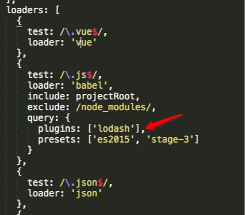
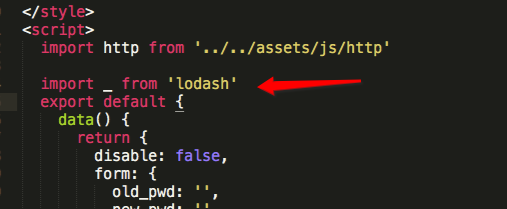
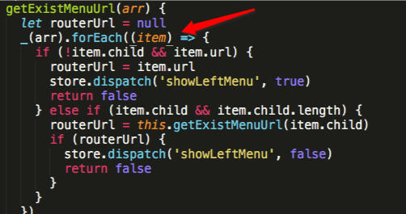
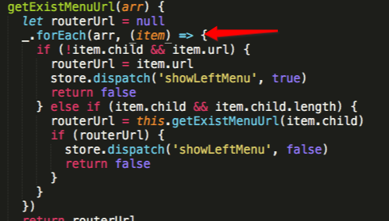
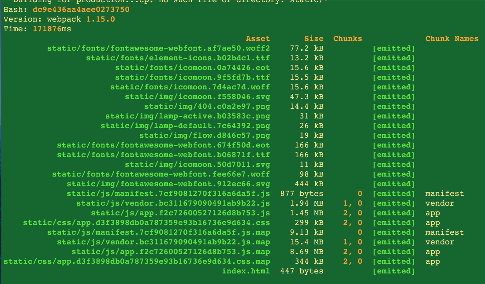
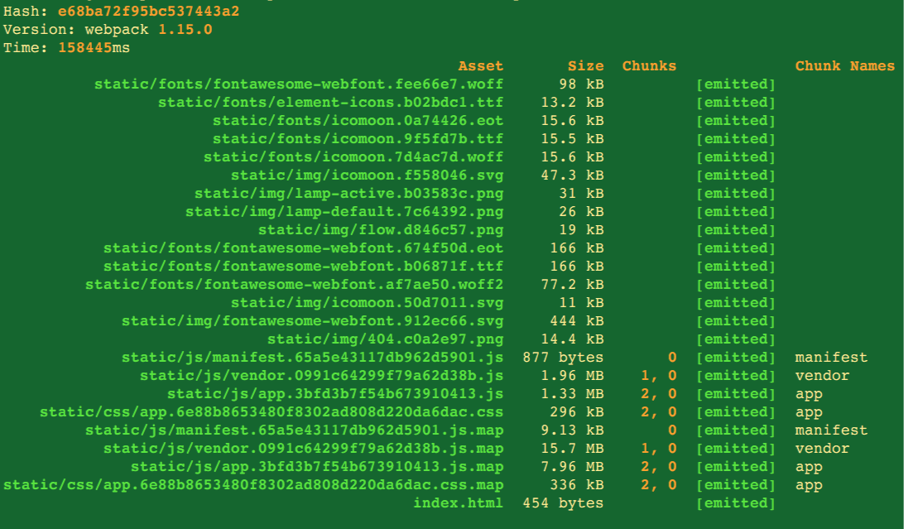

超级框架性能优化方案

##lodash引入优化

lodash仅引入需要的方法
babel-plugin-lodash  不支持链式使用（针对链式使用是否有替代方案），需要在使用的文件内引入lodash，而不能在main中一次性引入
lodash-webpack-plugin 具体配置还需要研究

实施步骤：

1.引入babel-plugin-lodash

	root $npm i babel-plugin-lodash --save-dev
	
2.webpack配置文件中引入plugin

3.在用到lodash方法的文件中替换单独引入

4.注意的问题
	
>不支持链式调用：如
	

需要改成如下格式

5.build打包结果对比

<figure class="half">
	
	
</figure>
	
TODO:此处需要说明打包后的各个文件干嘛用的

vender默认打包node_module 下的所有依赖，因为添加了两个包，所以vender稍大

##多余包引入问题

echart引入zrender占用很大空间

vuejs在vender 中出现两次

webpack --display-modules --sort-modules-by size按照模块大小显示，可以突出优化比较大的模块

webpack 命令行配置熟悉

##加快打包速度

webpack-parallel-uglify-plugin   https://zhuanlan.zhihu.com/p/25212283

##获取打包统计数据查看项目依赖

>webpack --config build/webpack.base.conf.js --profile --json > stats.json

生成json文件

>性能分析工具

 [analyse分析工具](http://webpack.github.io/analyse/) 
 
 [webpack-visualizer](https://chrisbateman.github.io/webpack-visualizer/)
 
 [Webpack Chart](https://alexkuz.github.io/webpack-chart/)
 
 [webpack-bundle-size-analyzer](https://github.com/robertknight/webpack-bundle-size-analyzer)

找到频繁引用的依赖包
疑问：这些依赖模块是否是只需要引入一次
devDependence在build的时候是不会被打包点吗？

##使用 dllPlugin & DllReferencePlugin

##sourcemap
[Perfect SourceMaps are slow.](http://webpack.github.io/docs/build-performance.html)

devtool: eval-cheap-module-source-map

